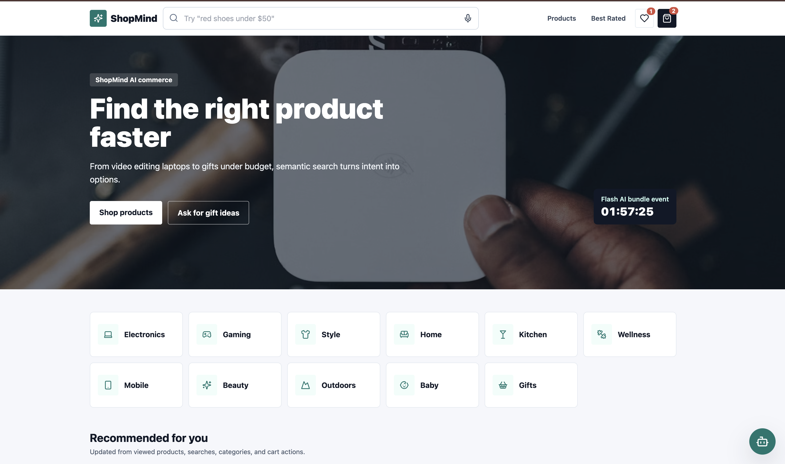
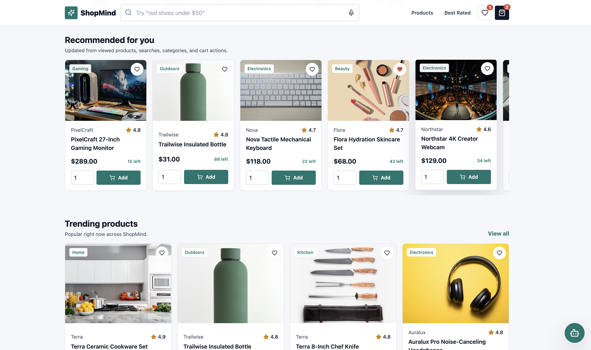
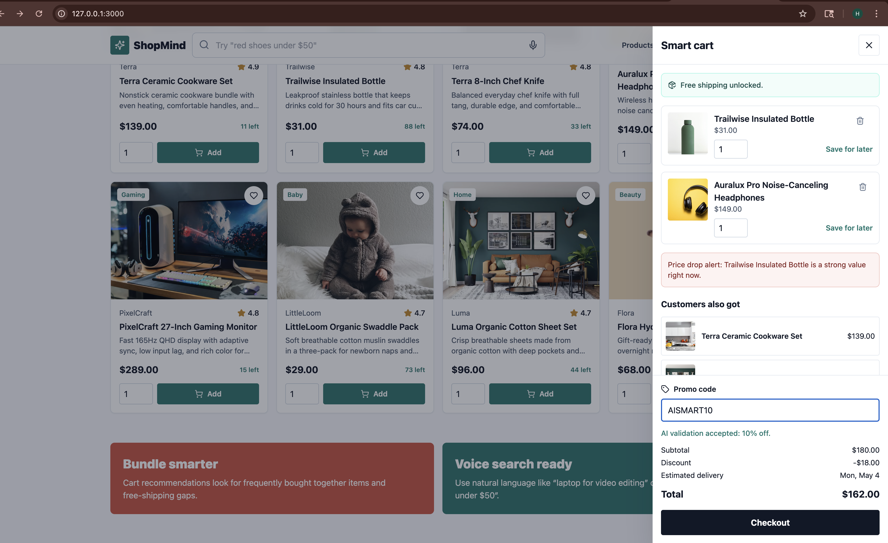
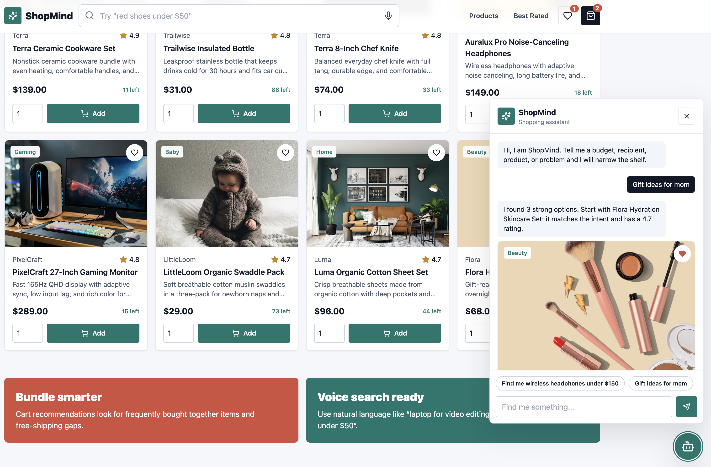

# ShopMind

ShopMind is an AI-enhanced e-commerce platform scaffold built with React 18, TypeScript, TailwindCSS, FastAPI, PostgreSQL + pgvector, Redis, Docker, and Nginx.

## What is included

- Personalized homepage with recommendations, trending products, recently viewed items, countdown promotions, and category navigation.
- Product listing with responsive grid, advanced filters, sorting, infinite loading behavior, quick view, wishlist, and quantity add-to-cart controls.
- AI-style semantic search with autocomplete, recent searches, voice search via Web Speech API, spelling correction, match highlighting, and zero-result suggestions.
- Product detail pages with gallery zoom, variants, stock status, recommendation sections, bundles, review sentiment summary, Q&A, add-to-cart animation, and buy-now CTA.
- Floating ShopMind assistant with streaming responses, quick replies, embedded product cards, and session history.
- Smart cart drawer with save-for-later, promo validation, free-shipping upsells, price-drop alerts, live totals, and estimated delivery.
- Frontend personalization event tracking and real-time recommendation updates.
- FastAPI services for products, recommendations, semantic search, assistant chat, personalization events, and reviews.
- Docker Compose stack for frontend, backend, PostgreSQL + pgvector, Redis, and Nginx reverse proxy.

## Screenshots

### Homepage hero and categories



Shows the ShopMind landing experience with the AI commerce hero, semantic search bar, countdown promotion, cart/wishlist indicators, and category navigation.

### Personalized recommendations and trending products



Shows the personalized "Recommended for you" carousel and trending product grid with product cards, ratings, stock counts, wishlist controls, and add-to-cart actions.

### Smart shopping cart



Shows the slide-out smart cart with free-shipping messaging, cart line items, save-for-later controls, AI upsell suggestions, promo-code validation, discount calculation, delivery estimate, and checkout total.

### AI shopping assistant



Shows the floating ShopMind assistant answering a gift recommendation request with streaming-style chat output, quick replies, and embedded product cards.

## Run locally

```bash
docker compose up --build
```

Then open:

- Frontend: http://localhost:3000
- Backend API docs: http://localhost:8000/docs
- Nginx proxy: http://localhost

The backend works without an `OPENAI_API_KEY` by using deterministic local ranking, correction, summarization, and assistant fallbacks. Add `OPENAI_API_KEY` to enable live model-backed behavior where implemented.

## Deploy on Vercel

This repository includes `vercel.json` and `api/index.py` so Vercel can build the React frontend from `frontend/` and serve the FastAPI app through `/api`.

Use these Vercel project settings:

- Framework Preset: `Vite`
- Install Command: `npm install`
- Build Command: `npm --prefix frontend run build`
- Output Directory: `frontend/dist`

Set these environment variables in Vercel when you are ready for live AI services:

- `OPENAI_API_KEY`: optional; without it, ShopMind uses deterministic local AI fallbacks.
- `CORS_ORIGINS`: optional; set it to your Vercel domain if you later host the backend separately.

After deployment, verify:

- Frontend: `https://your-vercel-domain/`
- API health: `https://your-vercel-domain/api/health`
- Product API: `https://your-vercel-domain/api/products`

## Contributors

- [@harry2611](https://github.com/harry2611)
